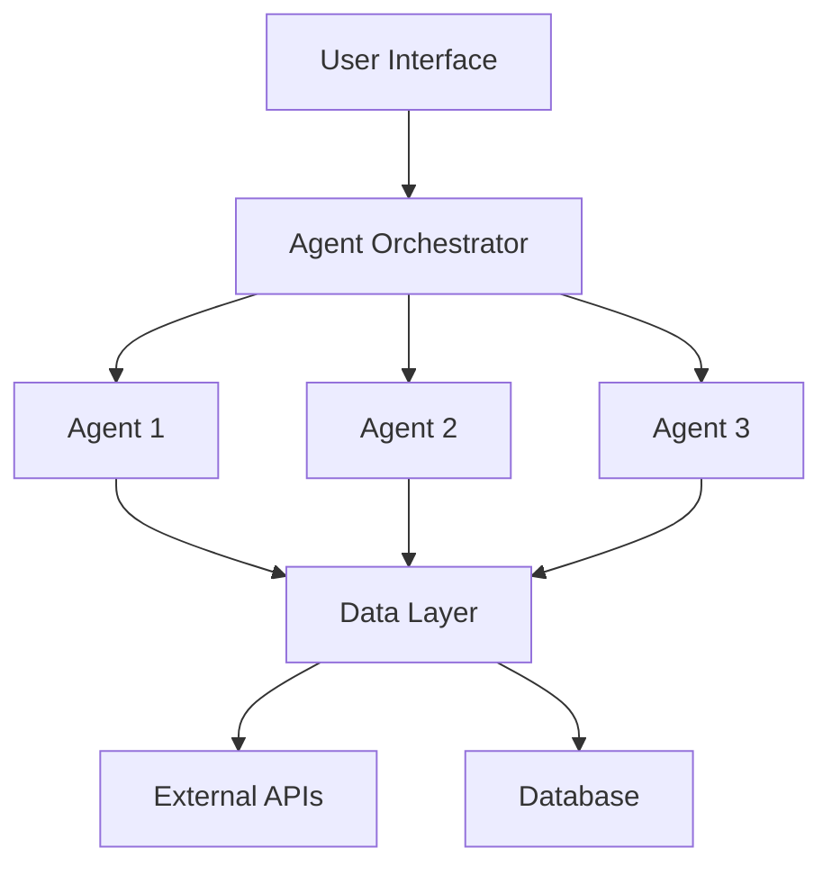

# AI Agents Documentation

## Overview

This document serves as a central registry and configuration guide for AI agents used in the AIOpsSoftware system.

---

## Agent Registry

### Agent Template

```yaml
Agent Name: [Name]
Type: [Conversational/Task-Based/Autonomous/Monitoring]
Status: [Active/Inactive/Development]
Version: [X.Y.Z]
Created: [YYYY-MM-DD]
Last Updated: [YYYY-MM-DD]
```

**Purpose**: [Brief description of what this agent does]

**Capabilities**:
- [Capability 1]
- [Capability 2]
- [Capability 3]

**Configuration**:
- **Model**: [e.g., GPT-4, Claude, etc.]
- **Temperature**: [0.0-1.0]
- **Max Tokens**: [number]
- **System Prompt**: [Link or brief description]

**Integration Points**:
- [System/Service 1]
- [System/Service 2]

**Dependencies**:
- [Dependency 1]
- [Dependency 2]

**Monitoring & Metrics**:
- [Metric 1]
- [Metric 2]

---

## Active Agents

### 1. [Agent Name 1]

```yaml
Agent Name: Example Agent
Type: Task-Based
Status: Active
Version: 1.0.0
Created: 2026-01-31
Last Updated: 2026-01-31
```

**Purpose**: [Description]

**Capabilities**:
- [List capabilities]

**Configuration**:
- **Model**: [Model name]
- **Temperature**: [Value]
- **Max Tokens**: [Value]
- **System Prompt**: [Description or path]

**Integration Points**:
- [Integration details]

**Dependencies**:
- [Dependencies]

**Monitoring & Metrics**:
- [Metrics]

---

## Agent Development Pipeline

### Development Stages

1. **Planning**
   - Define agent purpose and scope
   - Identify required capabilities
   - Design system prompts
   - Define success metrics

2. **Development**
   - Implement agent logic
   - Configure model parameters
   - Create integration points
   - Write unit tests

3. **Testing**
   - Functional testing
   - Performance testing
   - Edge case validation
   - User acceptance testing

4. **Deployment**
   - Production deployment
   - Monitoring setup
   - Documentation completion
   - Team training

5. **Maintenance**
   - Performance monitoring
   - Regular updates
   - Bug fixes
   - Feature enhancements

---

## Best Practices

### System Prompt Design

- **Be Specific**: Clearly define the agent's role and boundaries
- **Provide Context**: Include relevant background information
- **Set Constraints**: Define what the agent should and shouldn't do
- **Include Examples**: Provide sample interactions when helpful

### Configuration Guidelines

- **Temperature Settings**:
  - 0.0-0.3: Deterministic, factual tasks
  - 0.4-0.7: Balanced creativity and consistency
  - 0.8-1.0: Creative, exploratory tasks

- **Token Limits**:
  - Consider response length requirements
  - Balance cost vs. capability
  - Monitor actual usage patterns

### Error Handling

- Implement graceful degradation
- Provide meaningful error messages
- Log failures for analysis
- Have fallback mechanisms

### Security Considerations

- Validate all inputs
- Sanitize outputs
- Implement rate limiting
- Monitor for abuse patterns
- Protect sensitive data

---

## Integration Architecture



---

## Monitoring & Analytics

### Key Metrics

- **Performance Metrics**:
  - Response time
  - Token usage
  - Success rate
  - Error rate

- **Quality Metrics**:
  - User satisfaction
  - Task completion rate
  - Accuracy
  - Relevance

- **Cost Metrics**:
  - API costs
  - Token consumption
  - Infrastructure costs

### Logging Strategy

- Log all agent interactions
- Track performance metrics
- Monitor error patterns
- Analyze usage trends

---

## Troubleshooting

### Common Issues

#### Agent Not Responding
- Check API connectivity
- Verify authentication tokens
- Review rate limits
- Check system status

#### Poor Response Quality
- Review system prompt
- Adjust temperature settings
- Increase max tokens
- Provide more context

#### High Latency
- Optimize prompt length
- Reduce max tokens
- Check network connectivity
- Review model selection

---

## Change Log

### Version History

#### v1.0.0 - 2026-01-31
- Initial agents.md structure created
- Added agent template
- Defined best practices
- Created monitoring framework

---

## Resources

### Documentation
- [Link to API documentation]
- [Link to model documentation]
- [Link to integration guides]

### Tools
- [Development tools]
- [Testing frameworks]
- [Monitoring dashboards]

### Support
- **Technical Support**: [Contact information]
- **Emergency Contact**: [Contact information]
- **Documentation**: [Link to wiki/docs]

---

## Future Enhancements

- [ ] Multi-agent collaboration framework
- [ ] Advanced analytics dashboard
- [ ] Automated testing suite
- [ ] Performance optimization tools
- [ ] Enhanced security features

---

*Last Updated: 2026-01-31*
*Maintained by: AIOpsSoftware Team*
