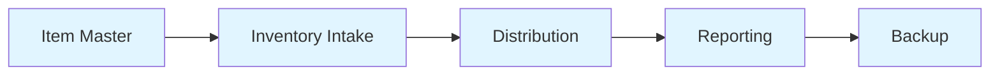
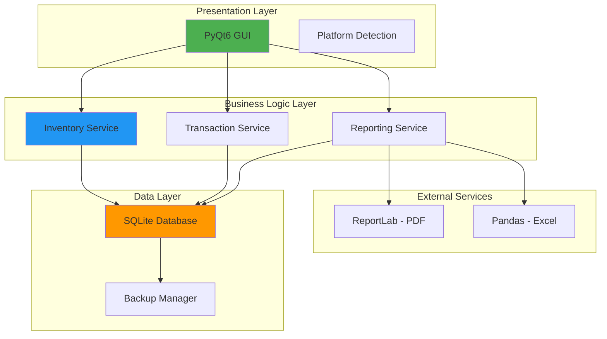

# PantryTracker Development Roadmap

**Project:** PantryTracker - Open Source Inventory System for Food Pantries  
**Version:** 1.0 MVP  
**Last Updated:** 2026-01-31  
**Status:** Planning Phase

---

## 🎯 Project Vision

Build a professional-grade, cross-platform desktop application that solves the unique inventory accounting challenge faced by non-profit food pantries: accurately tracking mixed "Zero-Cost" (donated) and "Purchased" goods while maintaining financial accuracy for COGS reporting.

---

## 📊 Success Metrics

| Metric | Target | Measurement |
|--------|--------|-------------|
| **Financial Accuracy** | 100% mathematical accuracy | Automated tests on weighted average calculations |
| **Report Generation Speed** | < 5 seconds | End-of-month financial reports |
| **Volunteer Onboarding** | < 15 minutes | Time to first successful transaction |
| **Data Integrity** | Zero corruption incidents | SQLite database reliability |
| **Cross-Platform** | Windows 10+ & macOS 11+ | Native look and feel on both platforms |

---

## 🗺️ Development Phases

### **Phase 1: MVP - "The Paper Killer"** ⭐ *Current Focus*

**Timeline:** 8-10 weeks  
**Goal:** Replace manual binder/Excel sheet with reliable desktop application

#### Core Deliverables



#### Feature Breakdown

##### 1. Foundation (Week 1-2)
- [x] Project structure setup
- [ ] Virtual environment configuration
- [ ] Dependency installation (PyQt6, SQLite3, ReportLab, Pandas)
- [ ] Database schema implementation
- [ ] Cross-platform detection system
- [ ] Git repository initialization

##### 2. Item Master Management (Week 2-3)
- [ ] Create/Edit/View items interface
- [ ] SKU and barcode input support
- [ ] 2-level category hierarchy
- [ ] Unit of Measure (UOM) selection
- [ ] Reorder threshold configuration
- [ ] Soft delete implementation (preserve transaction history)
- [ ] Item search and filtering

##### 3. Inventory Intake - The Differentiator (Week 3-5)
- [ ] **Purchase Mode** (Blue UI)
  - Supplier tracking
  - Quantity input
  - Unit cost entry
  - Total cost basis update
  
- [ ] **Donation Mode** (Green UI)
  - Optional donor tracking
  - Quantity input
  - Fair market value entry
  - Zero-cost accounting logic

- [ ] **Weighted Average Cost Engine**
  ```python
  # Core Formula Implementation
  new_avg_cost = (total_cost_basis + new_incoming_cost) / 
                 (qty_on_hand + new_incoming_qty)
  ```
  - Integer-based currency (cents) to prevent floating-point drift
  - Real-time cost basis updates
  - Audit trail for all cost changes

##### 4. Distribution & Output (Week 5-6)
- [ ] Distribution interface with reason codes:
  - Client Distribution
  - Spoilage
  - Internal Use
- [ ] Quantity validation (prevent negative inventory)
- [ ] COGS calculation at weighted average cost
- [ ] Transaction confirmation dialogs
- [ ] Undo functionality for recent transactions

##### 5. Reporting & Analytics (Week 6-8)
- [ ] **Financial Report** - "Cost of Goods Distributed"
  - Real money spent on distributed items
  - Monthly/Quarterly/Annual views
  - PDF export via ReportLab
  
- [ ] **Impact Report** - "Total Value Distributed"
  - Fair market value for donor newsletters
  - Donation vs. Purchase breakdown
  - Excel export via Pandas
  
- [ ] **Stock Status Report**
  - Items below reorder threshold
  - Zero-stock alerts
  - Category-based filtering

##### 6. Cross-Platform UI Polish (Week 8-9)
- [ ] **Windows Implementation**
  - Segoe UI typography
  - Standard window controls (top-right)
  - Vertical sidebar navigation
  
- [ ] **macOS Implementation**
  - San Francisco (SF Pro) typography
  - Traffic light controls (top-left)
  - Global menu bar integration
  - Cmd-based keyboard shortcuts

- [ ] **Accessibility (WCAG AA)**
  - Text contrast compliance
  - Logical tab order
  - System font scaling support
  - Screen reader compatibility

##### 7. Testing & Packaging (Week 9-10)
- [ ] Unit tests (80%+ coverage)
- [ ] Integration tests
- [ ] Cross-platform testing
- [ ] PyInstaller configuration
  - Windows .exe bundle
  - macOS .app bundle
- [ ] User documentation
- [ ] Sample database with demo data

---

### **Phase 2: Efficiency** 🚀

**Timeline:** 4-6 weeks (Post-MVP Launch)  
**Goal:** Speed up data entry and improve user experience

#### Features

##### Barcode Scanner Integration
- [ ] USB HID barcode scanner support
- [ ] Auto-populate item fields on scan
- [ ] Scan-to-distribute workflow
- [ ] Scanner configuration UI

##### Dashboard & Visualization
- [ ] Real-time inventory value chart
- [ ] Distribution trends (weekly/monthly)
- [ ] Top distributed items
- [ ] Donation vs. Purchase ratio visualization
- [ ] Interactive charts using Matplotlib/Plotly

##### Data Import/Export
- [ ] CSV import for initial migration
- [ ] Bulk item creation
- [ ] Transaction history export
- [ ] Backup scheduling system

##### Performance Optimization
- [ ] Database indexing optimization
- [ ] Lazy loading for large datasets
- [ ] Query caching
- [ ] Background task processing

---

### **Phase 3: Connected** 🌐

**Timeline:** 6-8 weeks (Future Enhancement)  
**Goal:** Remote safety and collaboration features

#### Features

##### Cloud Backup Integration
- [ ] Google Drive API integration
- [ ] Dropbox API integration
- [ ] Automatic daily backups
- [ ] Backup restoration wizard
- [ ] Conflict resolution

##### Email Automation
- [ ] SMTP configuration
- [ ] Automated monthly reports to board members
- [ ] Low-stock email alerts
- [ ] Donation receipt generation

##### Multi-User Considerations
- [ ] User authentication system
- [ ] Role-based permissions (Admin, Volunteer, View-Only)
- [ ] Audit log for user actions
- [ ] Concurrent access handling

##### Advanced Analytics
- [ ] Predictive inventory forecasting
- [ ] Seasonal trend analysis
- [ ] Donor impact tracking
- [ ] Budget vs. actual spending reports

---

## 🏗️ Technical Architecture

### Technology Stack



### Core Components

| Component | Technology | Purpose |
|-----------|-----------|---------|
| **GUI Framework** | PyQt6 | Cross-platform native UI |
| **Database** | SQLite 3 | Serverless, single-file storage |
| **PDF Generation** | ReportLab | Financial reports |
| **Excel Export** | Pandas | Data analysis and export |
| **Packaging** | PyInstaller | Standalone executables |
| **Testing** | pytest | Unit and integration tests |
| **Version Control** | Git | Source code management |

---

## 🎓 Best Practices & Standards

### Code Quality
- **PEP 8** compliance for all Python code
- **Type hints** for function signatures
- **Docstrings** for all public methods
- **Unit tests** with 80%+ coverage
- **Code reviews** before merging

### Database Design
- **Immutable audit logging** - never delete transaction records
- **Integer currency storage** - prevent floating-point errors
- **Foreign key constraints** - maintain referential integrity
- **Indexed queries** - optimize performance
- **Regular backups** - prevent data loss

### Security
- **SQL injection prevention** - parameterized queries only
- **Input validation** - sanitize all user inputs
- **Error handling** - graceful degradation
- **Audit logging** - track all data modifications
- **Data encryption** - for sensitive information (Phase 3)

### User Experience
- **Consistent terminology** - use domain language
- **Visual feedback** - loading indicators, success/error messages
- **Keyboard shortcuts** - power user efficiency
- **Undo functionality** - prevent user mistakes
- **Contextual help** - tooltips and documentation

---

## 📅 Milestone Schedule

| Milestone | Target Date | Deliverables |
|-----------|-------------|--------------|
| **M1: Foundation** | Week 2 | Database schema, project structure, dev environment |
| **M2: Core CRUD** | Week 4 | Item management, basic intake/distribution |
| **M3: Accounting Engine** | Week 6 | Weighted average cost, dual-mode intake |
| **M4: Reporting** | Week 8 | Financial & Impact reports, PDF/Excel export |
| **M5: MVP Release** | Week 10 | Cross-platform builds, documentation, testing complete |
| **M6: Efficiency Features** | Week 16 | Barcode scanning, dashboard, CSV import |
| **M7: Connected Features** | Week 24 | Cloud backup, email automation, multi-user |

---

## 🚧 Risk Management

### Technical Risks

| Risk | Impact | Mitigation |
|------|--------|------------|
| **Floating-point precision errors** | High | Use integer cents for all currency |
| **Cross-platform UI inconsistencies** | Medium | Platform-specific testing, conditional styling |
| **Database corruption** | High | Automated backups, transaction rollback |
| **PyInstaller compatibility issues** | Medium | Early packaging tests, dependency pinning |
| **Performance with large datasets** | Low | Database indexing, pagination, lazy loading |

### User Adoption Risks

| Risk | Impact | Mitigation |
|------|--------|------------|
| **Volunteer resistance to change** | High | Simple UI, extensive training, gradual rollout |
| **Data migration errors** | High | CSV import tool, validation, rollback capability |
| **Learning curve too steep** | Medium | Video tutorials, in-app help, tooltips |
| **Missing critical features** | Medium | User feedback sessions, iterative development |

---

## 🔄 Feedback & Iteration

### User Testing Checkpoints
- **Week 4:** Item management UI testing with Margaret (Manager persona)
- **Week 6:** Intake workflow testing with Sam (Volunteer persona)
- **Week 8:** Report generation testing with Board members
- **Week 10:** Full system UAT with pilot pantry

### Success Criteria for MVP Launch
- [ ] All Phase 1 features implemented and tested
- [ ] Zero critical bugs in issue tracker
- [ ] User documentation complete
- [ ] Successful deployment at 1 pilot location
- [ ] Positive feedback from both personas (Margaret & Sam)
- [ ] Financial reports match manual Excel calculations

---

## 📚 Resources & References

### Development Resources
- [PyQt6 Documentation](https://www.riverbankcomputing.com/static/Docs/PyQt6/)
- [SQLite Best Practices](https://www.sqlite.org/bestpractice.html)
- [ReportLab User Guide](https://www.reportlab.com/docs/reportlab-userguide.pdf)
- [PyInstaller Manual](https://pyinstaller.org/en/stable/)

### Design Resources
- [macOS Human Interface Guidelines](https://developer.apple.com/design/human-interface-guidelines/macos)
- [Windows Design Principles](https://learn.microsoft.com/en-us/windows/apps/design/)
- [WCAG 2.1 Guidelines](https://www.w3.org/WAI/WCAG21/quickref/)

---

## 🎯 Next Steps

### Immediate Actions (This Week)
1. Set up development environment
2. Create project repository structure
3. Initialize SQLite database with schema
4. Build basic PyQt6 window with platform detection
5. Implement first CRUD operation (Item creation)

### Developer Onboarding
1. Clone repository
2. Create virtual environment: `python -m venv venv`
3. Install dependencies: `pip install -r requirements.txt`
4. Initialize database: `python scripts/init_db.py`
5. Run application: `python src/main.py`

---

**Document Status:** Living document - updated weekly during active development  
**Owner:** Senior Python Developer  
**Stakeholders:** Product Manager, Food Pantry Managers, Volunteer Coordinators
